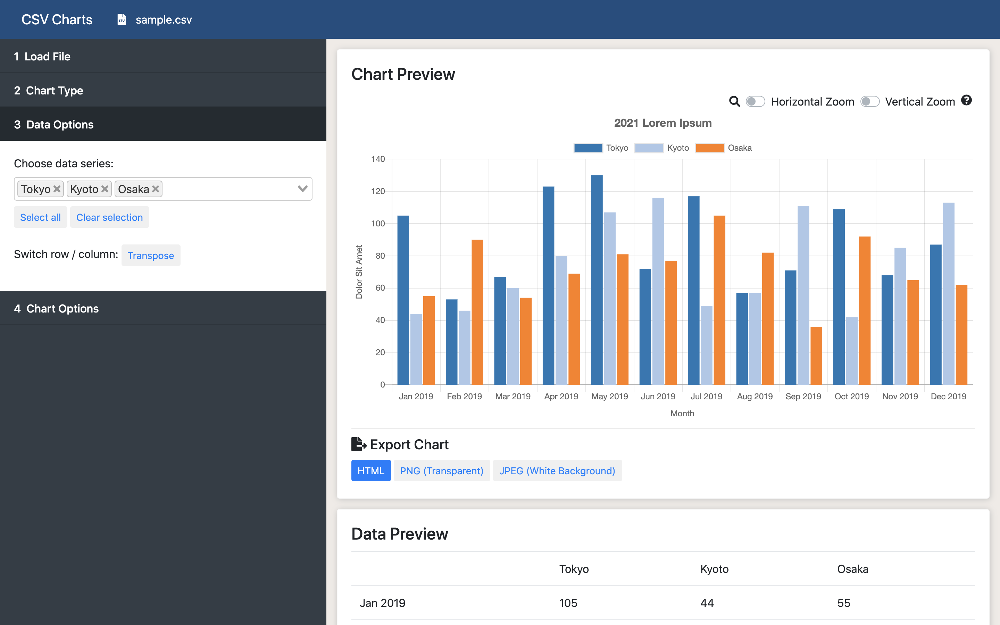

# csv-charts
A tool to create interactive HTML5 Chart.js charts from a CSV table.
Charts exported can be placed in any webpages.

Demo page: https://c-lake.github.io/csv-charts/

#### Note

- This tool is completely client-side and data files are only processed on your computer.

- In the HTML export prompt,

  

  The numbers in yellow (**1001** here) is a random number and should be unique to each chart in a single webpage. In case of collision, press **Export HTML** again and another number will be generated.

#### TODO
- [x] Select multiple series
- [x] More chart types: scatter...
- [x] Large file mode: Limit size of CSV preview for significantly faster large file loads
- [x] Exportable charts to embed in HTML
- [x] Limit data range
- [x] Complete interface remake

Automatic chart coloring from: https://nagix.github.io/chartjs-plugin-colorschemes/